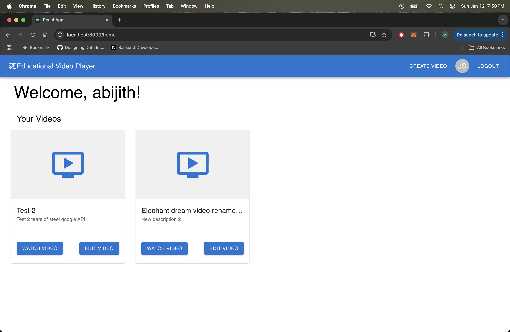

# Getting Started with Educational Video Player

This project was bootstrapped with [Create React App](https://github.com/facebook/create-react-app).

## Overview

This application allows users to view, upload, and edit their videos in a simple UI. Users will be required to login with a username (firstname_lastname) regardless of if they have or have not uploaded videos with the provided username before, the actions to upload videos will remain available for new users, while existing users will see their old videos.

Users can watch their videos by clicking on the 'Watch Video' button on any of the Home page video cards, as well as the ability to edit the video title and description in a separate page using the 'Edit Video' button.

After clicking 'Watch Video', the user can watch the video in a new page while being able to customize their viewing preferences with full playback functionality, pausing, adjusting playback speed, and viewing in fullscreen.

Users can comment on their videos while being able to see their past comments ordered by latest comments with scrolling functionality. 

New and existing logged-in users can also upload videos by clicking on the 'Create Video' button on the top right of the header which navigates them to a page where they can provide a title, description, and link to a video. The 'Upload Video' button on this page will successfully upload the video which will then be available to view and edit back on the home page.

The 'Educational Video Player' header and icon at the top left of the header will navigate users back to the home page as an alternative to the 'Back to Home' button available on the Create Video, Edit Video, and Watch Video pages. 

# Platform View

Login Page
 

Home Page
 

Video Player Page
 

Video Comments Page
 

Create Video Page
 

Edit Video Page
 

## Test Users

Log in with a username with the format `firstname_lastname` to view a blank platform with no videos, and start by uploading videos using the 'Create Video' button

Otherwise, here are several usernames I've created and used with uploaded videos and comments

`john_smith`
`test_user`
`abijith_mani`

## Available Scripts

In the project directory, you can run:

### `npm install`

Install necessary dependencies

### `npm start`

Runs the app in the development mode.\
Open [http://localhost:3000](http://localhost:3000) to view it in your browser.

## Technical Specifications

- Leveraged lazy loading for video cards
- Created components for improved readability, debugging, and testing
- Added UI features such as Fade to load video cards fading in on page load
- Leveraged MaterialUI for all styling
- Used local sessionStorage to store logged-in user_id for current platform session
- Used navigate from react-router to handle page routing
